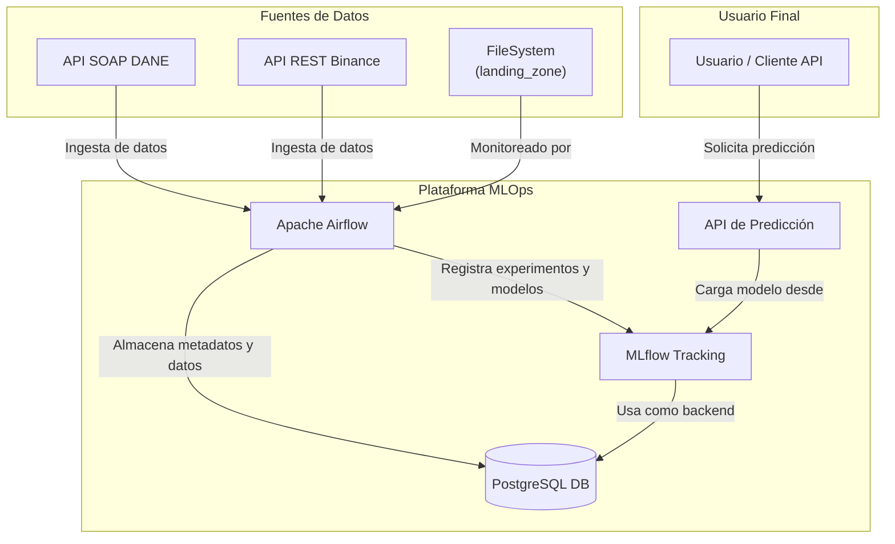

# Proyecto de Pipeline MLOps End-to-End


## Descripción

Este proyecto implementa una plataforma y varios pipelines de MLOps de extremo a extremo utilizando un stack tecnológico moderno y open-source. La plataforma está completamente contenerizada con Docker y orquestada con Apache Airflow.

El objetivo es demostrar las mejores prácticas de ingeniería de datos y MLOps a través de varios casos de uso realistas, incluyendo:

  * **Ingesta de datos desde APIs**: Conexión a servicios web (REST y SOAP).
  * **Procesamiento de archivos**: Detección y procesamiento automático de archivos (`.xls`) depositados en un directorio.
  * **Entrenamiento y optimización de modelos**: Un pipeline completo de Machine Learning para series de tiempo, incluyendo ingeniería de características, optimización de hiperparámetros y registro de experimentos.
  * **Despliegue de modelos**: Exposición de un modelo entrenado a través de una API REST para predicciones en tiempo real.

## Arquitectura y Tecnologías

La plataforma se compone de varios servicios que interactúan entre sí, orquestados por Docker Compose.



-   **Orquestación**: Apache Airflow (construido desde una imagen de Miniconda para manejar dependencias complejas).
-   **Seguimiento de Experimentos**: MLflow.
-   **Base de Datos**: PostgreSQL (utilizada por Airflow, MLflow y para almacenar los datos de los pipelines).
-   **Despliegue de Modelos**: FastAPI.
-   **Contenerización**: Docker & Docker Compose.
-   **Librerías Clave**: Pandas, Zeep (para SOAP), `python-binance`, `TA-Lib`, Scikit-learn, XGBoost, Optuna.

## Estructura del Proyecto

```
/mi_proyecto_mlops/
├── airflow/
│   ├── dags/             # Contiene el código de todos los pipelines de Airflow.
│   ├── Dockerfile        # Define la imagen personalizada de Airflow (base Miniconda).
│   └── requirements.txt  # Dependencias de Python para el entorno de Airflow.
├── data/
│   ├── landing_zone/     # Carpeta para depositar archivos .xls a ser procesados.
│   └── archive/          # Los archivos procesados con éxito se mueven aquí.
├── fastapi_app/
│   ├── Dockerfile        # Define la imagen de la API (base Miniconda).
│   ├── main.py           # El código de la API de predicción.
│   └── requirements.txt  # Dependencias de Python para la API.
├── mlflow_custom/
│   └── Dockerfile        # Añade el driver de PostgreSQL a la imagen de MLflow.
├── postgres_init/
│   └── init-databases.sh # Script para crear bases de datos adicionales al inicio.
├── .env                  # Archivo de configuración con variables de entorno.
└── docker-compose.yml    # El archivo principal que define y orquesta todos los servicios.
```

## Guía de Instalación y Puesta en Marcha

Sigue estos pasos para levantar toda la plataforma.

### 1. Prerrequisitos

  * Tener **Docker** y **Docker Compose** instalados y en funcionamiento.

### 2\. Archivo de Configuración

Crea un archivo llamado `.env` en la raíz del proyecto y copia el siguiente contenido. Contiene las credenciales y configuraciones para los servicios.

```env
# Variables para la Base de Datos PostgreSQL
POSTGRES_USER=admin
POSTGRES_PASSWORD=admin
POSTGRES_DB_MLFLOW=mlflow_db
POSTGRES_DB_AIRFLOW=airflow_db

# UID/GID de Airflow para permisos (usar 50000 para Linux/Mac)
AIRFLOW_UID=50000

# Clave secreta para la comunicación interna de Airflow
AIRFLOW__WEBSERVER__SECRET_KEY=gN-_gN4DD_yNAn2vN_yNAn-_gN4D-yNAgN4DD_yNAnE=

# Habilitar el test de conexiones en la UI de Airflow
AIRFLOW__CORE__TEST_CONNECTION=Enabled
```

### 3\. Construir y Levantar los Servicios

Abre una terminal en la raíz del proyecto y ejecuta el siguiente comando. La primera vez tardará varios minutos en construir todas las imágenes personalizadas.

```bash
docker compose up -d --build
```

### 4\. Configuración Manual en Airflow

Para que los DAGs de ingesta de datos del DANE funcionen, necesitas realizar una configuración única en la interfaz de Airflow.

  * **Ve a la UI de Airflow**: `http://localhost:8080`
  * **Crea una Conexión a la Base de Datos**:
      * Ve a **Admin -\> Connections** y crea una nueva conexión.
      * **Connection Id**: `postgres_sipsa`
      * **Connection Type**: `Postgres`
      * **Host**: `postgres_db`
      * **Schema**: `airflow_db`
      * **Login**: `admin`
      * **Password**: `admin`
      * **Port**: `5432`
      * Guarda la conexión.
  * **Crea las Variables**:
      * Ve a **Admin -\> Variables** y crea las siguientes variables:
      * `sipsa_wsdl_url`: `https://appweb.dane.gov.co/sipsaWS/SrvSipsaUpraBeanService?WSDL`
      * `sipsa_historical_start_date`: `2023-01-01`
      * `sipsa_retry_delay_minutes`: `60`

## Acceso a los Servicios

Una vez que todo esté corriendo, puedes acceder a las diferentes interfaces:

  * **Airflow UI**: [http://localhost:8080](https://www.google.com/search?q=http://localhost:8080) (user: `admin`, pass: `admin`)
  * **MLflow UI**: [http://localhost:5000](https://www.google.com/search?q=http://localhost:5000)
  * **API Docs (FastAPI)**: [http://localhost:8000/docs](https://www.google.com/search?q=http://localhost:8000/docs)

## Resumen de los Pipelines (DAGs)

  * **`dane_sipsa_prices_ingestion`**: Se conecta a un servicio web SOAP del DANE, extrae datos de precios, los carga en una tabla de staging y los fusiona en una tabla de producción en un esquema dedicado (`sipsa_data`).
  * **`file_ingestion_from_excel`**: Vigila la carpeta `data/landing_zone`. Cuando un nuevo archivo `.xls` es depositado, lo procesa, transforma los datos de un formato ancho a uno largo, lo carga en la base de datos y mantiene un registro de los archivos procesados en una tabla de auditoría.
  * **`bitcoin_data_ingestion`**: Se conecta a la API de Binance para descargar el historial de precios de BTC/USDT y lo guarda como un archivo CSV.
  * **`bitcoin_training_pipeline`**: Orquesta un pipeline de ML completo que usa los datos de Bitcoin para:
    1.  Calcular indicadores técnicos con `TA-Lib`.
    2.  Encontrar los mejores hiperparámetros con `Optuna`.
    3.  Entrenar un modelo final con `XGBoost`.
    4.  Registrar todos los experimentos y el modelo final en MLflow.